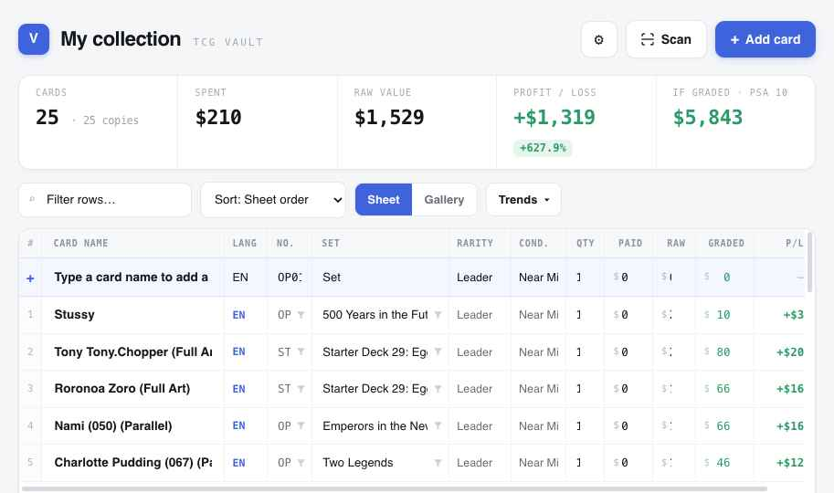

# MyTCG — One Piece Card Collection Tracker

A sleek, spreadsheet-style tracker for your One Piece TCG collection. Add cards as
fast as typing in a row, track spend vs. market value, profit/loss, and graded
upside, and look cards up against the live community catalog.



## Features

- **Excel-like sheet** — every cell is inline-editable (name, number, set, rarity,
  condition, qty, paid / raw / graded). A permanent add-row at the top.
- **Live catalog lookup** — autocomplete pulls real cards, art and market prices
  from [optcgapi.com](https://optcgapi.com) (booster sets + starter decks).
  Self-heals if the API hiccups.
- **Scan a card** — camera + on-device OCR (Tesseract.js) reads the printed card
  number and matches it to the catalog. Photo-upload fallback for desktop.
- **EN / JP language** column with colour-coded badges.
- **Hover preview** — hover a card's number to see its full art.
- **Trends** — value-over-time chart and a monthly-budget tracker with a spend ring.
- **Gallery view**, filtering by number/set, sorting, CSV import/export.
- Currency, columns and summary cards are all configurable in Settings.

## Run it

It's a single static page — no build step.

```bash
# any static server, e.g.
python3 -m http.server 8000
# then open http://localhost:8000
```

Or just open `index.html` in a browser. (A server is recommended so the camera /
OCR features work, which require a secure context.)

### GitHub Pages

Push to GitHub (see below), then in the repo: **Settings → Pages → Source: `main` /
root**. Your tracker will be live at `https://<you>.github.io/MyTCG/`.

## Data & persistence

Your collection is stored in your browser's `localStorage` (per-device). Use
**Settings → Export CSV** for backups, and **Import from CSV** to restore or move
between devices. (A cloud-sync option via Supabase can be added — see issues.)

## Tech

- Vanilla front-end rendered by a small component runtime (`support.js`).
- [Tesseract.js](https://github.com/naptha/tesseract.js) for OCR (loaded from CDN).
- One Piece data courtesy of the community [optcgapi.com](https://optcgapi.com) API.

## License

MIT — see `LICENSE`. One Piece is © Eiichiro Oda / Shueisha / Bandai; card images
and data belong to their respective owners. This is a personal, non-commercial tool.
